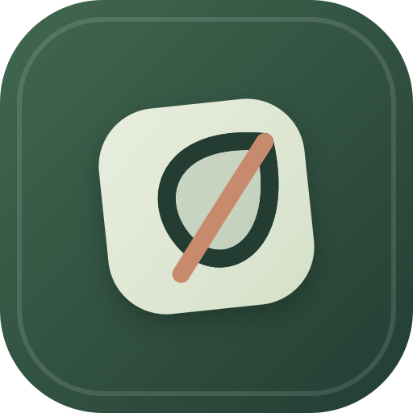

<div align="center">
  

# Pasos · Crecemos en familia

Una aplicación privada para acompañar hábitos, registrar puntos y celebrar avances en familia.

</div>

Primera versión funcional, en español, para una sola familia con hijos de 8 a 14 años. Incluye interfaces responsive de padres e hijos, autenticación y persistencia local. Los padres pueden sumar y restar puntos de la barra general.

## Abrir la aplicación

Necesitas **Node.js 22.13 o posterior** y npm. Se recomienda una versión LTS compatible.

Desde la carpeta del proyecto:

```sh
npm install
npm run dev -- --hostname 127.0.0.1
```

Abre **http://localhost:3000**.

1. Crea el nombre de vuestra familia y el primer acceso de adulto. La contraseña requiere al menos 10 caracteres.
2. En **Mi familia**, añade a los niños: nombre o alias de acceso único, edad, avatar, clave de al menos 6 caracteres y objetivo.
3. Revisa las tareas de ejemplo y el catálogo inicial de recompensas.
4. Ajusta los umbrales y la zona horaria en **Configuración**. Allí puedes añadir otro progenitor.
5. Cada niño entra desde la misma página con su nombre y clave. Solo recibe sus propios datos.

No hay cuentas ni contraseñas predeterminadas. Los perfiles y movimientos de las pruebas se crean en una base de datos temporal distinta de la familiar.

## Funciones incluidas

| Padres | Hijos |
| --- | --- |
| Panel familiar e historial por hijo | Panel propio con avatar, objetivo y barra de colores |
| Alta de hijos y edición de edad, avatar y objetivo | Consulta de tareas y envío para aprobación |
| Ajustes positivos y negativos con motivo obligatorio | Catálogo y solicitud de recompensas |
| Biblioteca de rutinas, asignación a uno o varios hijos y archivo/reactivación | Consulta de tareas y rutinas personales |
| Tareas diarias automáticas y retos de una sola vez | Envío de tareas para aprobación o concesión automática |
| Creación, archivo y reactivación de recompensas | Consulta del estado y comentarios de sus peticiones |
| Aprobación, rechazo comentado y entrega de premios | Mensajes de reconocimiento de la familia |
| Mensajes motivacionales personalizados | Ideas prácticas para ganar autonomía |
| Configuración de umbrales y acceso del otro progenitor | Acceso separado del panel de administración |

## Dos indicadores diferentes

### Barra general: cómo vamos respecto al acuerdo

- Cada perfil empieza en **50/100**.
- Se pueden registrar ajustes enteros de **−100 a +100**, distintos de cero. El resultado se limita a **0–100**.
- Cada movimiento conserva motivo, autor, fecha y variación efectivamente aplicada.
- Los umbrales iniciales son **60: dentro de lo acordado** y **85: objetivo alcanzado**; los padres pueden cambiarlos.
- Los ajustes negativos están habilitados inicialmente y pueden desactivarse.
- La barra es acumulativa, sin reinicio automático diario o semanal.
- Las franjas van de tonos cálidos a turquesa y verde, con texto y cifras para no depender únicamente del color.

### Saldo de recompensas: puntos disponibles para canjear

- Empieza en **0** y aumenta con los puntos positivos, incluso si la barra ya está en 100.
- Los ajustes negativos de conducta **no reducen este saldo**.
- Solicitar un premio no descuenta puntos: se comprueba y descuenta el saldo **al aprobar el canje**.
- El canje no modifica la barra general. Entregar el premio tampoco vuelve a descontar puntos.

Una tarea diaria solo puede enviarse/aprobarse una vez por hijo y día según la zona horaria familiar. Las rutinas automáticas conceden sus puntos al marcarse; si no se realizan ese día, no suman. Un reto puntual no vuelve a abrirse al día siguiente. Los cambios se guardan en transacciones y las solicitudes revisadas no se pueden puntuar dos veces.

## Base educativa

Los consejos distinguen recomendaciones profesionales, investigación y decisiones de producto:

- **Academia Americana de Pediatría, 2023:** [Positive Reinforcement Through Rewards](https://www.healthychildren.org/English/family-life/family-dynamics/Pages/Positive-Reinforcement-Through-Rewards.aspx). Objetivos concretos, participación del niño, seguimiento y retirada gradual. Su referencia principal es la etapa de 5–12 años y aconseja evitar penalizaciones en los cuadros de puntos.
- **Deci, Koestner y Ryan, 1999:** [metaanálisis de 128 estudios sobre recompensas y motivación intrínseca](https://doi.org/10.1037/0033-2909.125.6.627). El tipo y contexto de las recompensas importan; ciertas recompensas esperadas pueden disminuir el interés propio.

Los puntos negativos son una opción solicitada por la familia, **no una recomendación atribuida a estas fuentes**. Los colores, umbrales y puntuación inicial no son medidas clínicas. Esta primera biblioteca no equivale a un programa validado específicamente para todo el intervalo 8–14; ampliar las fuentes de adolescencia es un siguiente paso.

## Diseño motivacional y hábitos

La herramienta aplica actualmente varias técnicas de cambio de conducta: objetivos concretos, tareas graduadas, señales de contexto, primer paso pequeño, automonitorización, feedback inmediato y refuerzo positivo. La biblioteca propone planes del tipo **cuándo ocurre → primer paso**, por ejemplo «después de cenar → mirar la agenda».

Esto no promete hábitos «sin esfuerzo». La evidencia recomienda reducir fricción, apoyar autonomía, competencia y relación, y retirar gradualmente los puntos cuando la conducta se consolida. Las recompensas deben ser significativas para cada niño y elegidas con su participación; los fallos no deben convertirse en castigos ni deudas.

Referencias adicionales: [Behavior Change Techniques and Their Mechanisms of Action](https://pmc.ncbi.nlm.nih.gov/articles/PMC6636886), [Digital Behavior Change Intervention Designs for Habit Formation](https://pmc.ncbi.nlm.nih.gov/articles/PMC11161714), [Implementation intentions in children](https://pubmed.ncbi.nlm.nih.gov/41784001) y [Self-Determination Theory, APA](https://www.apa.org/research-practice/conduct-research/self-determination-theory).

## Datos, ejecución y alojamiento

Los datos se guardan en `data/family.json` o en la ruta indicada por `FAMILY_DATA_DIR`. El fichero se reemplaza de forma atómica y debe estar en un directorio privado. Las contraseñas se almacenan como hashes scrypt con sal individual; las sesiones usan tokens aleatorios y cookies HTTP-only. Todas las acciones comprueban el rol en el servidor. Los intentos fallidos de acceso se limitan por nombre.

Variables opcionales en `.env.local` (ver `.env.example`):

| Variable | Uso |
| --- | --- |
| `FAMILY_DATA_DIR` | Ruta absoluta a un directorio privado y persistente. Por defecto: `data/` dentro del proyecto. |
| `COOKIE_SECURE` | `true` cuando el sitio se sirve por HTTPS; `false` para desarrollo local HTTP. |

Para generar y ejecutar la versión de producción:

```sh
npm run build
npm start -- --hostname 127.0.0.1
```

Esta versión necesita Node.js 18.17 o posterior, un único proceso Node.js y almacenamiento persistente. El despliegue para Synology DS213j usa Node.js 18.18.2, salida standalone y el puerto 3100. No está preparada para almacenamiento efímero de funciones serverless ni para varias instancias independientes. El acceso desde otros dispositivos o desde Internet requiere configurar un servidor y la red; no se ha publicado un alojamiento.

En el DS213j, el arranque se realiza con `ops/synology-start.sh`, instalado como `/volume1/homes/roberto/pasos-en-familia-prod/start.sh`. Para que se inicie después de reiniciar DSM, crea en **Programador de tareas** una tarea de usuario con evento **Arranque**, ejecutada como `roberto`, cuyo comando sea:

```sh
/volume1/homes/roberto/pasos-en-familia-prod/start.sh
```

La aplicación queda disponible en `http://192.168.0.19:3100` dentro de la red local. El directorio persistente es `/volume1/homes/roberto/pasos-en-familia-data`.

Para hacer una copia de seguridad sencilla, detén la aplicación y copia **todo el directorio de datos** a un lugar privado. Para restaurar, reemplaza ese directorio con la aplicación detenida. Nunca publiques su contenido en el repositorio.

## Comprobaciones

```sh
npm run lint
npm run typecheck
npm run build
npm test
```

Las pruebas usan Playwright con **Google Chrome instalado**, puerto `3107` y un directorio de datos temporal aislado. Cubren límites de puntuación, permisos, separación de hermanos, repetición de tareas, saldo insuficiente, fechas y el flujo completo en escritorio y móvil. Las capturas quedan en `test-results/`.

## Estructura

```text
src/app/             Entrada de Next.js, acciones del servidor y estilos
src/components/      Pantallas de acceso, portal e ilustraciones
src/lib/model.ts     Tipos, estados, fechas y contenido educativo
src/lib/domain.ts    Reglas de puntos, tareas, aprobaciones y privacidad
src/lib/db.ts        Persistencia local atómica y transacciones
src/lib/auth.ts      Credenciales, sesiones y límites de acceso
tests/               Pruebas de reglas y recorrido de navegador
```

Tecnologías: Next.js 14, React 18, TypeScript y almacenamiento JSON local. Las fuentes visuales se solicitan a Google Fonts con alternativas locales si no hay conexión.

## Alcance de esta primera versión

El panel muestra los últimos 30 movimientos, conservando todos en el fichero de datos. Las sesiones de distintos dispositivos reflejan cambios al recargar; todavía no hay sincronización en tiempo real. Las tareas y recompensas pueden archivarse y recrearse; no hay edición completa de sus campos. No se incluyen recuperación de contraseñas, eliminación de perfiles, informes exportables, notificaciones externas, tareas semanales ni publicación en Internet.
